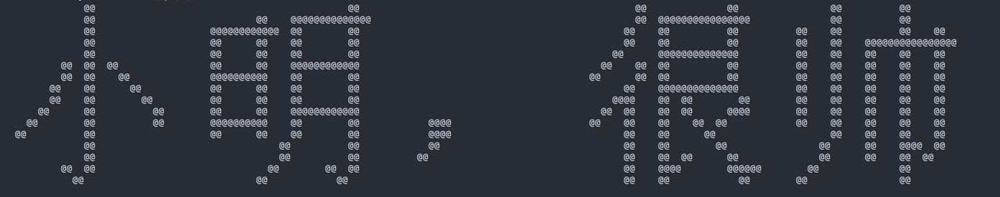

Special thanks to [@slipperstree](https://github.com/slipperstree/raspled).

## Introduction

This is a program for printing Chinese characters in a 16x16 lattice, written in Python 3. A `HZK16.dat` file is needed, from which the program reads information of characters.

## Prerequisites

- Numpy

## Usage

```
$ python3 print_char.py [OPTIONS]
```

### Options

```
-h, --horizontal   Display characters in horizontal mode.
                   NOTE that in order to display characters correctly in horizontal mode,
                   you MUST zoom out the window to make enough space for the whole sentence.
-s, --style        Choose the symbol used to form the lattice, the default is @
                   recommendation: █, ▒, ░, ●
```
## Preview


Looks better when **zoomed out**.




## Todolist

These are never gonna be done.

- [x] Display the list of characters horizontally
- [ ] Print colorful output
- [ ] Convert halfwidth to fullwidth
