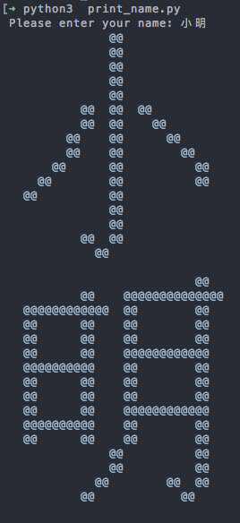

Special thanks to [@slipperstree](https://github.com/slipperstree/raspled).

## Introduction

This is a program for printing Chinese characters in a 16x16 lattice, written in Python 3. A `HZK16.dat` file is needed, from which the program reads information of characters.

## Prerequisites

- Numpy

## Usage

```
$ python3 print_char.py [OPTIONS]
```

### Options

```
-s, --style   choose the symbol used to form the lattice, the default is @
-o, --os      set the operating system, win/mac/linux, the default is win
```
## Preview



Looks better when **zoomed out**.

## Todolist

These are never gonna be done.

- [ ] Display the list of characters horizontally
- [ ] Print colorful output
- [ ] Convert halfwidth to fullwidth
